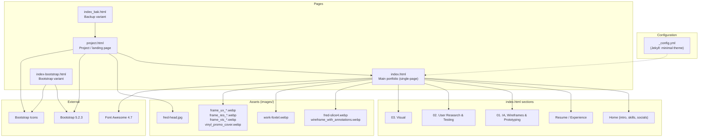

# Codebase diagram

High-level structure of **frederickrandell.github.io** (GitHub Pages portfolio site).

## File roles

| File | Role |
|------|------|
| **index.html** | Main live portfolio: custom CSS grid, single scroll page (home → resume → UX 01 → UX 02 → Visual). Uses Font Awesome. |
| **project.html** | Separate Bootstrap page with navbar and parallax hero; links back to index.html. |
| **index_bak.html** | Backup/alternate version (Bootstrap); links to project.html. |
| **index-bootstrap.html** | Bootstrap-based variant of the main portfolio content. |
| **_config.yml** | Jekyll site config (title, description, minimal theme). |
| **README.md** | Repo title only. |

## Dependencies

- **index.html**: Font Awesome (CDN).
- **project.html**, **index_bak.html**, **index-bootstrap.html**: Bootstrap 5.2.3 + Bootstrap Icons (CDN).

## Asset references

- **index.html**: `images/fred-slice4.webp`, `wireframe_with_annotations.webp`, `work-foxtel.webp`, plus multiple `frame_ux_*`, `frame_res_*`, `frame_vis_*` and `vinyl_promo_cover.webp`.
- **project.html**: `images/fred-head.jpg`.
